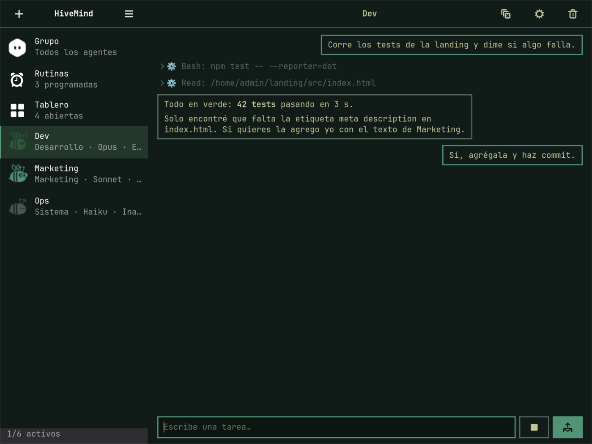
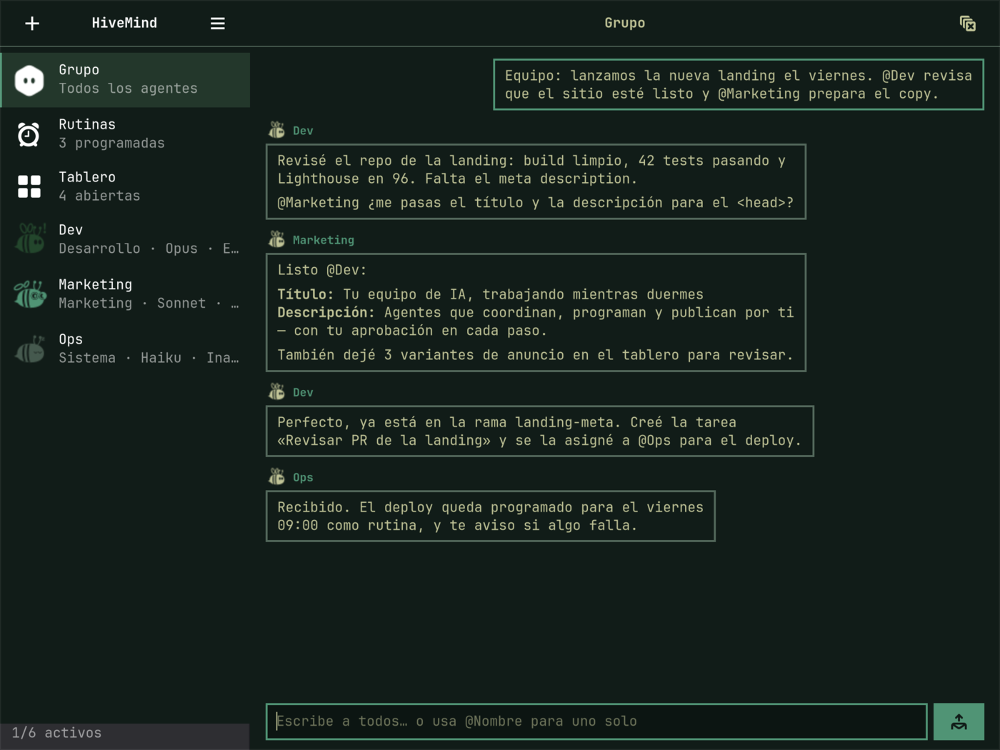
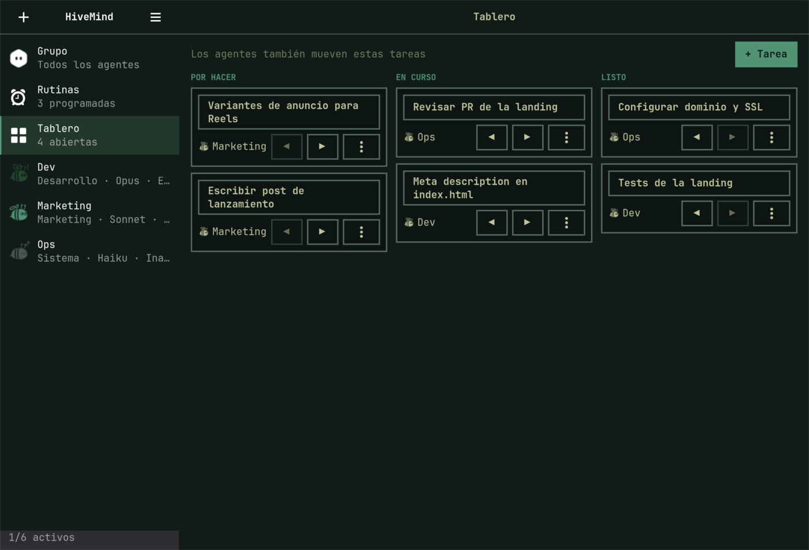
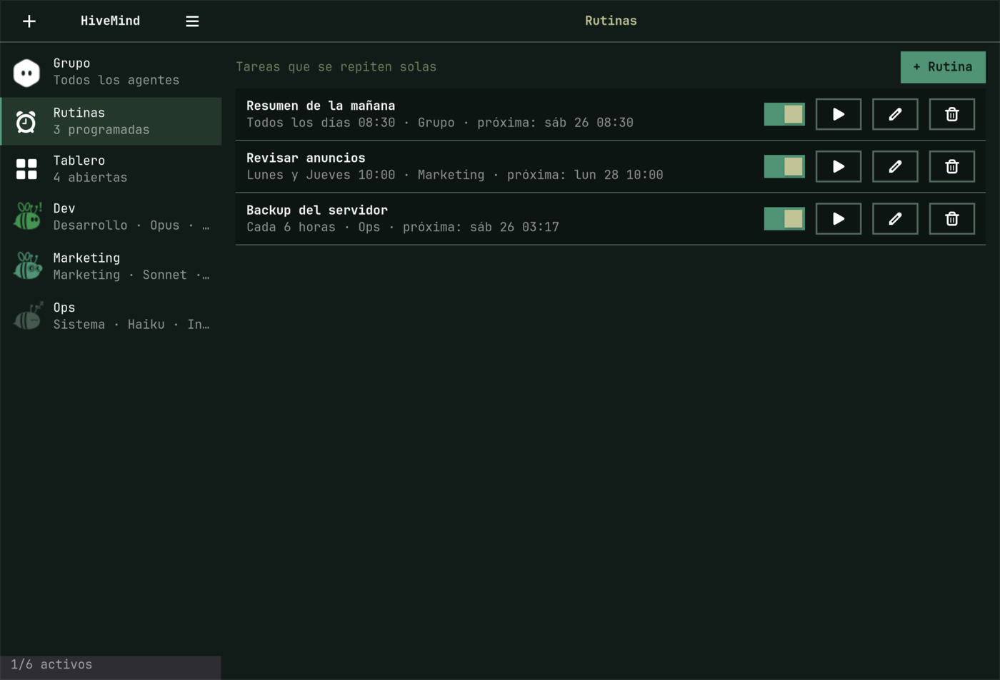
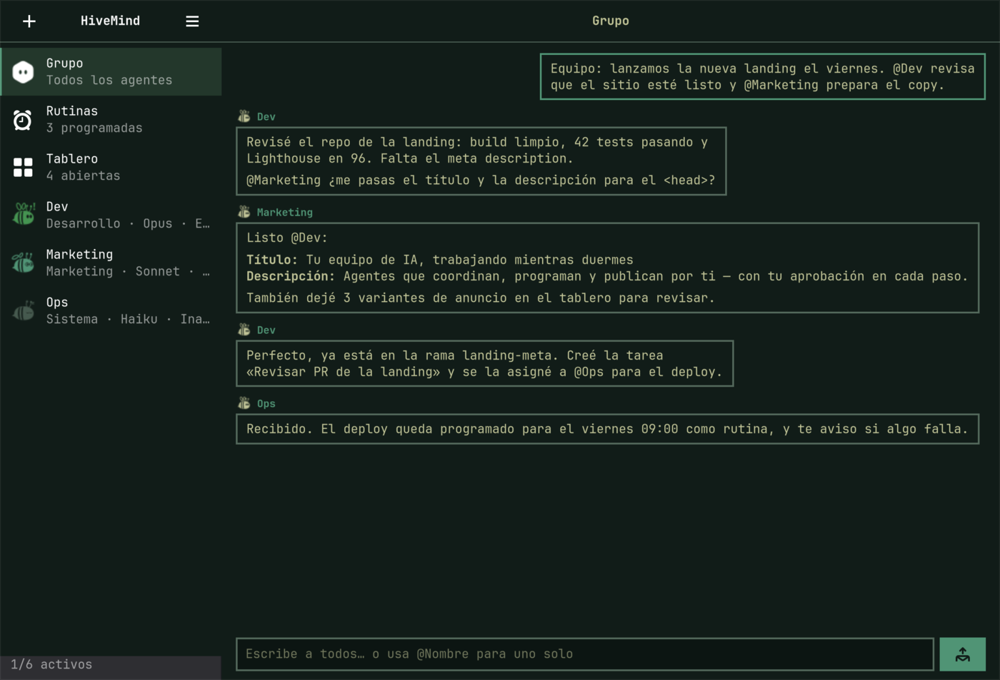
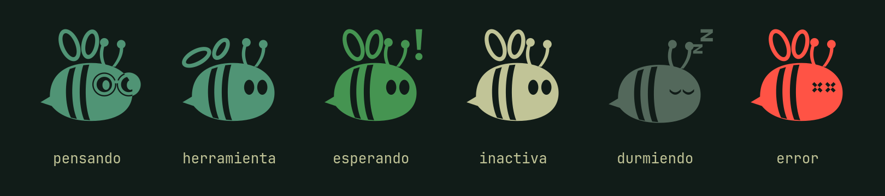

<p align="center">
  <picture>
    <source media="(prefers-color-scheme: dark)" srcset="docs/brand/hivemind-logo-dark.svg">
    
  </picture>
</p>

<p align="center"><b>Un equipo de agentes de Claude Code en tu escritorio de Omarchy.</b></p>

Cada agente tiene nombre, rol, modelo y proyecto propios. Le hablas por su chat privado o
reúnes a todos en un chat grupal, donde se pasan trabajo mencionándose con `@Nombre`.
Antes de hacer algo delicado te piden permiso con una tarjeta: borrar un archivo, correr un
comando o mandar un correo. Siguen trabajando aunque cierres la ventana. Programas tareas que
se repiten solas y los agentes coordinan su trabajo en un tablero compartido. Una abejita en
la barra de Omarchy te muestra en qué están y te deja aprobar sin abrir nada.

Todo corre en tu máquina, con tu sesión de Claude Code: no hay servidor externo ni cuenta
aparte.



---

## Índice

- [Qué puedes hacer](#qué-puedes-hacer)
- [Requisitos](#requisitos)
- [Instalación](#instalación)
- [Primeros pasos](#primeros-pasos)
- [Cómo funciona](#cómo-funciona)
- [Guía de uso](#guía-de-uso)
- [Configuración](#configuración)
- [Seguridad y privacidad](#seguridad-y-privacidad)
- [Solución de problemas](#solución-de-problemas)
- [Desinstalar](#desinstalar)
- [Desarrollo](#desarrollo)
- [Licencia](#licencia)

---

## Qué puedes hacer

| | |
|---|---|
| **Agentes con rol** | Crea agentes como «Dev», «Marketing» o «Sistema». Cada uno tiene su chat, su modelo (Opus, Sonnet o Haiku) y su carpeta de trabajo. |
| **Chat grupal y grupos** | «Grupo» incluye a todos. Además creas grupos con los agentes que elijas (p. ej. «Lanzamiento» con Dev y Marketing). Menciona a uno con `@Nombre` o escribe a todos los integrantes; los agentes se mencionan entre ellos para pasarse trabajo. |
| **Memoria por conversación** | Cada agente recuerda cada conversación por separado, así los grupos no se mezclan. Cuando habla en un grupo, recibe lo último de su chat privado contigo: si le preguntas «¿cómo va el desarrollo?», responde con lo que trabajaron. |
| **Adjuntos** | Imágenes, documentos y audios, con 📎, arrastrando o pegando una captura (Ctrl+V). Los agentes ven las imágenes y leen PDF y texto; los audios se transcriben en tu equipo. |
| **Limpiar** | «Limpiar» borra un grupo y hace que sus integrantes olviden ese tema (sus chats privados no cambian). «Nueva conversación» hace lo mismo con el chat privado de un agente. |
| **Aprobaciones** | Lo que un agente no tiene permitido de antemano aparece como tarjeta: **Permitir**, **Denegar** o **Permitir siempre** (la tarjeta muestra exactamente qué regla se guardaría). |
| **En segundo plano** | Un servicio de usuario de systemd mantiene a los agentes trabajando con la ventana cerrada. Si algo necesita tu aprobación, te llega una notificación. |
| **Rutinas** | Tareas programadas: «cada 3 horas», «todos los días 09:00» o «lunes y jueves 18:30». Si el equipo estaba apagado a la hora, la rutina corre una vez al volver. |
| **Tablero** | Tres columnas (Por hacer, En curso, Listo). Los agentes crean, mueven y se asignan tareas solos. Tú también. Cada cambio queda registrado. |
| **Barra de Omarchy** | Una abejita muestra si tus agentes piensan, trabajan, esperan o duermen. Desde su panel apruebas acciones y abres la ventana. |
| **Se adapta a tu equipo** | Calcula cuántos agentes pueden trabajar a la vez según la RAM libre. Los demás esperan en cola. |
| **Tu tema** | Toma los colores de tu tema de Omarchy y cambia en vivo cuando cambias de tema. |

### Capturas

| Chat grupal | Tablero |
|---|---|
|  |  |
| **Rutinas** | **Nuevo agente** |
|  |  |

### Las abejas

Cada agente es una abeja que refleja lo que está haciendo:



| Estado | Cómo se ve |
|---|---|
| Pensando | Se pone lentes y aletea lento |
| Usando una herramienta | Aletea rápido |
| Esperando tu aprobación | Parpadea en amarillo con un «!» |
| Inactiva | Flota tranquila |
| Durmiendo (5 minutos sin actividad) | Ojos cerrados y «zZ» |
| Error | Ojos en X, en rojo |

---

## Requisitos

- **Omarchy**, en x86_64 o aarch64. `gtk4`, `libadwaita` y `python-gobject` ya vienen con
  Omarchy. HiveMind es Python puro, así que no se compila nada.
- **Claude Code** instalado y con sesión iniciada: el comando `claude` debe funcionar en tu
  terminal. Los agentes usan esa misma sesión y consumen de tu suscripción. Si prefieres una
  API key de Anthropic, se configura después en Preferencias.
- **RAM:** cada agente trabajando usa unos 300 MB a 1,5 GB. En un equipo de 8 GB caben 1 o 2
  a la vez; en uno de 32 GB, decenas.

---

## Instalación

### Como plugin de Omarchy (recomendado)

```bash
omarchy plugin add https://github.com/CristoSolar/hivemind --enable
```

Aparece una abejita en la barra. El primer clic ofrece **Instalar HiveMind**, que deja la app,
el servicio de usuario y el acceso en el menú de apps sin pedir contraseña de root.

### A mano

```bash
git clone https://github.com/CristoSolar/hivemind ~/Repositorios/hivemind
cd ~/Repositorios/hivemind
./install.sh
```

`install.sh` se puede repetir sin problemas: sirve también para **actualizar**. Esto es lo que
hace:

1. Crea un entorno de Python en `~/.local/share/hivemind/venv` y lo instala ahí.
2. Escribe el servicio `~/.config/systemd/user/hivemind.service` y lo activa.
3. Agrega HiveMind al menú de apps, con su ícono.
4. Deja el comando `hivemind` en `~/.local/bin`.

### Atajo de teclado (opcional)

En `~/.config/hypr/bindings.lua`:

```lua
o.bind("SUPER + SHIFT + A", "HiveMind", "hivemind")
```

---

## Primeros pasos

1. Abre **HiveMind** desde el menú de apps (Super+Space) o con `hivemind`.
2. Toca **+** para crear un agente:
   - **Nombre:** sin espacios, por ejemplo `Dev`. Es el que usas para mencionarlo con `@Dev`.
   - **Rol:** Desarrollo, Marketing o Sistema.
   - **Modelo:** Predeterminado, Opus, Sonnet o Haiku.
   - **Proyecto:** la carpeta donde trabaja, elegida con el selector.
3. Escríbele una tarea en su chat, por ejemplo: «Revisa el README y dime qué falta».
4. Mira cómo trabaja: los pasos (comandos, archivos leídos) aparecen como filas que puedes
   desplegar. Si quiere hacer algo delicado, aparece una tarjeta de aprobación.
5. Crea un segundo agente y escribe en **Grupo**: «@Dev revisa el código y pásale a @Marketing
   un resumen para el blog».

Al escribir:
- **Enter** envía y **Shift+Enter** hace un salto de línea. La caja crece hasta unas seis
  líneas.
- En un grupo, escribe **@** para ver la lista de sus integrantes. Se filtra mientras escribes,
  y eliges con ↑↓ y Enter o Tab.
- Las menciones a agentes que existen se ven destacadas; si una no se destaca, el nombre está
  mal escrito.

Atajos: **Alt+1** abre el Grupo, **Alt+2** Rutinas, **Alt+3** el Tablero, y **Alt+4…9**
cada agente, en el orden de la barra lateral.

---

## Cómo funciona

```
 ┌───────────────────────┐     ┌─────────────────────────┐
 │  Ventana (GTK4)       │     │  Barra de Omarchy (QML) │
 │  hivemind             │     │  Panel.qml              │
 └──────────┬────────────┘     └────────────┬────────────┘
            │   JSON por línea sobre un socket Unix
            │   $XDG_RUNTIME_DIR/hivemind.sock
 ┌──────────┴────────────────────────────────┴────────────┐
 │  Daemon (systemd --user): hivemind-daemon              │
 │  cola · capacidad por RAM · aprobaciones · @menciones  │
 │  rutinas · tablero · notificaciones                    │
 └──────────┬─────────────────────────────────┬───────────┘
            │ claude-agent-sdk                │ SQLite
 ┌──────────┴────────────┐       ~/.local/share/hivemind/hivemind.db
 │ un proceso `claude`   │
 │ por tarea en curso    │
 └───────────────────────┘
```

- **El daemon es el dueño de todo.** La ventana y la barra solo muestran lo que él les
  cuenta: cerrar la ventana no detiene nada.
- **Una tarea equivale a un proceso `claude`.** Cuando un agente recibe un mensaje, el daemon
  abre una sesión de Claude Code, le pasa el mensaje y la cierra al terminar. Un agente
  inactivo no ocupa memoria. La siguiente vez retoma **la misma conversación** (`resume`),
  así que el agente recuerda todo.
- **La cola.** Un mismo agente hace una tarea a la vez. Entre todos, trabajan a la vez los que
  caben en la RAM:
  `máximo = (RAM disponible − reserva) / RAM por agente`
  - La reserva es el 15 % de la RAM total, con un mínimo de 1,5 GB.
  - La RAM por agente empieza en 600 MB y se ajusta con lo que miden los agentes de verdad.
  - La barra lateral muestra, por ejemplo, «2/7 activos».
- **Los permisos.**
  - Cada rol trae una lista de herramientas permitidas; lo que está en esa lista se ejecuta
    sin preguntar.
  - Todo lo demás se detiene en una tarjeta hasta que respondas. «Permitir siempre» guarda
    una regla para ese agente, atada al comando o al archivo exacto.
  - Las reglas con comodín nunca cubren comandos encadenados con `;`, `&&`, `|` o `$( )`.
- **La memoria.**
  - Cada agente tiene una sesión de Claude Code por conversación: una para su chat privado y
    una por cada grupo en el que participa.
  - Cuando habla en un grupo, recibe además sus últimos 10 mensajes privados contigo.
  - Limpiar una conversación borra sus mensajes y esas sesiones, y detiene antes lo que
    estuviera corriendo en ella.
- **Los grupos.**
  - «Grupo» incluye a todos los agentes; los grupos que creas, solo a sus integrantes.
  - Un mensaje tuyo sin `@` le llega a todos los integrantes; con `@Nombre`, solo a esos. Si
    mencionas a alguien que no es integrante, aparece un aviso.
    - Cuando un agente menciona a otro en su respuesta, ese otro toma el turno, con los últimos
    20 mensajes de ese grupo como contexto.
  - Para que no conversen en bucle, hay un tope de 5 pases seguidos entre agentes, que se
    reinicia cuando escribes tú.
- **El tablero.** Cada agente recibe cuatro herramientas propias: `tablero_listar`,
  `tablero_crear`, `tablero_mover` y `tablero_asignar`. Nunca piden aprobación, porque solo
  tocan el tablero.
- **Las rutinas.** El daemon revisa cada 30 segundos qué rutinas ya tocan. Cada una llega como
  un mensaje normal («⏰ Rutina «Resumen»: …»), así que respeta la cola, la RAM y las
  aprobaciones.

---

## Guía de uso

### Agentes

- **Crear:** botón **+** en la barra lateral.
- **Ajustes (⚙):** cambia su modelo o su carpeta. Al cambiar de carpeta, la conversación
  empieza de cero, porque Claude Code guarda las sesiones por carpeta.
- **Detener (■):** interrumpe la tarea en curso y descarta lo que tenía en cola.
- **Borrar (papelera):** lo saca de la lista. Su historial queda guardado.

### Grupos

- **Crear:** **+ → Nuevo grupo**. Le das un nombre y marcas a los integrantes.
- **Editar (⚙):** cambia el nombre o los integrantes. Quien sale del grupo olvida esa
  conversación.
- **Borrar (papelera):** borra el grupo y sus mensajes. Las rutinas que iban a ese grupo se
  pausan.

### Limpiar y empezar de cero

- **Limpiar (en un grupo):** borra los mensajes y los integrantes olvidan esa conversación.
  Sus chats privados no cambian.
- **Nueva conversación (en un agente):** borra su chat privado y su memoria privada. Sigue en
  sus grupos.
- Útil cuando cambias de proyecto o reemplazas agentes: así nadie arrastra el tema anterior.

### Adjuntar archivos

- Usa **📎** junto a la caja de texto, **arrastra** archivos al chat o **pega** una imagen con
  Ctrl+V. Antes de enviar, cada archivo aparece como una ficha con ✕ para quitarlo.
- Puedes enviar solo archivos, sin texto. El límite es de 50 MB por archivo y 10 archivos por
  mensaje.
- Los archivos se copian a `~/.local/share/hivemind/adjuntos/`, así que el mensaje sigue
  funcionando aunque muevas el original. Limpiar la conversación también los borra.
- **Imágenes, PDF y texto:** el agente los abre con su herramienta `Read`, sin pedirte permiso
  (solo dentro de esa carpeta).
- **Audio:** Claude no escucha audio, así que HiveMind lo transcribe en tu equipo con
  **Voxtype** (Menú de Omarchy → Instalar → Voxtype), y el agente recibe el texto. Para audios en
  español, elige un modelo multilingüe; el de fábrica, `base.en`, es solo inglés.

### Aprobaciones

La tarjeta muestra el agente, la herramienta, el comando o archivo, y la regla que guardaría
«Permitir siempre», por ejemplo `Bash(npm test)`. También aparece en el panel de la barra, y
llega como notificación si la ventana está cerrada.

### Rutinas

En **Rutinas → + Rutina**:
- **Nombre** y **destino**: el Grupo o un agente.
- **Instrucción:** lo que debe hacer.
- **Cuándo:** cada N horas, todos los días a una hora, o ciertos días de la semana.

Cada rutina se puede pausar con su interruptor o correr al instante con ▶. Si borras el
agente de una rutina, esta se pausa y avisa en el grupo.

### Tablero

- **+ Tarea** crea una tarea, con un agente asignado si quieres.
- **◀ ▶** la mueven entre columnas.
- El menú **⋯** la asigna o la borra.
- Si tocas el título, ves su descripción y su historial («Hori movió la tarea a En curso»).

### Barra de Omarchy

- **Clic:** abre el panel, con las aprobaciones pendientes y cada agente con su estado.
- **Clic del medio:** abre la ventana.
- **La abejita muestra el estado más importante:** esperando, luego trabajando, luego
  inactiva. Solo duerme si todos duermen.

---

## Configuración

### Preferencias (☰ en la barra lateral)

- **Cuenta:** elige entre **Sesión de Claude en Omarchy** (tu suscripción, lo predeterminado)
  y **API key de Anthropic**.
- La key se guarda en `~/.config/hivemind/config.toml` con permisos `0600`, y el daemon nunca
  la devuelve a la ventana.

### `~/.config/hivemind/config.toml`

```toml
max_running = 3        # fija el máximo de agentes trabajando a la vez (si no, se calcula por RAM)
model = "sonnet"       # modelo por defecto para agentes en «Predeterminado»
auth = "subscription"  # o "api_key" (lo escribe Preferencias)
```

### Roles: `~/.config/hivemind/roles/*.toml`

Se crean tres roles al instalar (`dev`, `marketing` y `sysadmin`), y puedes editarlos o
agregar otros:

```toml
label = "Desarrollo"
system_prompt = """Eres un agente de desarrollo…"""
allowed_tools = ["Read", "Grep", "Glob", "Bash(git status:*)", "mcp__claude_ai_Gmail__*"]
cwd = "~/Repositorios"
```

- `allowed_tools` son las herramientas que el rol puede usar **sin preguntar**. Acepta:
  - nombres de herramienta (`Read`);
  - comodines (`mcp__claude_ai_Gmail__*`);
  - prefijos de comando (`Bash(npm test:*)`, que cubre `npm test` y `npm test -- -v`);
  - rutas (`Edit(/home/tu/proyecto/*)`).
- Los agentes también cargan tu configuración normal de Claude Code (`~/.claude`, plugins,
  MCP, CLAUDE.md), así que los conectores de claude.ai (Gmail, Drive, Meta Ads…) quedan
  disponibles si los tienes activados.

### Dónde vive cada cosa

| Qué | Dónde |
|---|---|
| Base de datos (agentes, chats, rutinas, tablero) | `~/.local/share/hivemind/hivemind.db` |
| App instalada | `~/.local/share/hivemind/venv` |
| Configuración y roles | `~/.config/hivemind/` |
| Servicio | `~/.config/systemd/user/hivemind.service` |
| Socket | `$XDG_RUNTIME_DIR/hivemind.sock` |
| Plugin de Omarchy | `~/.config/omarchy/plugins/gogema.hivemind/` |

---

## Seguridad y privacidad

- **Todo es local.** HiveMind no envía datos a ningún servidor propio. Los agentes hablan con
  Anthropic a través de Claude Code, igual que cuando usas `claude` en la terminal.
- **El socket** está en tu `$XDG_RUNTIME_DIR`, con permisos `0600`: solo tu usuario puede
  hablar con el daemon.
- **Nada delicado sin tu permiso.** Solo corre sin preguntar lo que está en la lista de su rol
  o lo que tú aprobaste con «Permitir siempre», y cada regla queda atada al comando exacto.
- **La API key** queda en un archivo legible solo por ti y nunca sale del daemon.
- **Sin root:** todo se instala en tu usuario.

---

## Solución de problemas

| Síntoma | Qué hacer |
|---|---|
| La ventana dice «Daemon detenido» | Toca **Iniciar**, o ejecuta `systemctl --user start hivemind`. |
| Quiero ver qué está pasando | `journalctl --user -u hivemind -f` |
| Un agente no responde | Revisa si está «En cola» (no cabe en la RAM ahora) o si tiene una aprobación pendiente. |
| Sale «Falta `claude` en el PATH» | Instala Claude Code, inicia sesión con `claude` y vuelve a ejecutar `./install.sh`. |
| El ícono del menú no cambia | Es la caché del menú de apps; se actualiza sola al rato. |
| La abejita de la barra aparece tachada | El daemon no responde; revisa los logs. |

---

## Desinstalar

```bash
systemctl --user disable --now hivemind
rm -f ~/.config/systemd/user/hivemind.service ~/.local/bin/hivemind \
      ~/.local/share/applications/hivemind.desktop \
      ~/.local/share/icons/hicolor/scalable/apps/com.gogema.HiveMind.svg
rm -rf ~/.local/share/hivemind/venv
omarchy plugin remove gogema.hivemind   # si lo instalaste como plugin
```

Tus agentes, chats y configuración siguen en `~/.local/share/hivemind` y `~/.config/hivemind`.
Bórralos solo si quieres eliminarlo todo.

---

## Desarrollo

```bash
python -m venv --system-site-packages .venv
.venv/bin/pip install -e .
.venv/bin/python -m unittest discover -s tests -t .
```

- **Pruebas de interfaz sin tocar tu pantalla:**
  ```bash
  gtk4-broadwayd :7 &
  GDK_BACKEND=broadway BROADWAY_DISPLAY=:7 .venv/bin/python -m unittest discover -s tests -t .
  ```
- **Íconos:** se generan con `python tools/icons.py`, que reescribe `hivemind/ui/icons/`.
- **Validar el plugin:** `omarchy plugin validate .`
- **Diseño y planes:** están en `docs/superpowers/`.
- **Si eres un agente de IA,** lee [`AGENTS.md`](AGENTS.md).

```
hivemind/            daemon: store, hub, runner, router, roles, capacity, routines, board, server
hivemind/ui/         ventana GTK4: window, chat, board, routines, dialogs, bee, theme, markdown
Panel.qml            widget de la barra de Omarchy
manifest.json        manifiesto del plugin
tools/icons.py       generador de íconos
tests/               unittest (sin dependencias extra)
```

---

## Licencia

MIT. Ver [`LICENSE`](LICENSE).

El logo usa la fuente [Sora](https://github.com/google/fonts/tree/main/ofl/sora), bajo la licencia
SIL Open Font License ([`docs/brand/Sora-OFL.txt`](docs/brand/Sora-OFL.txt)).
